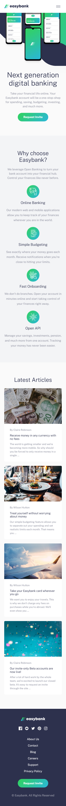
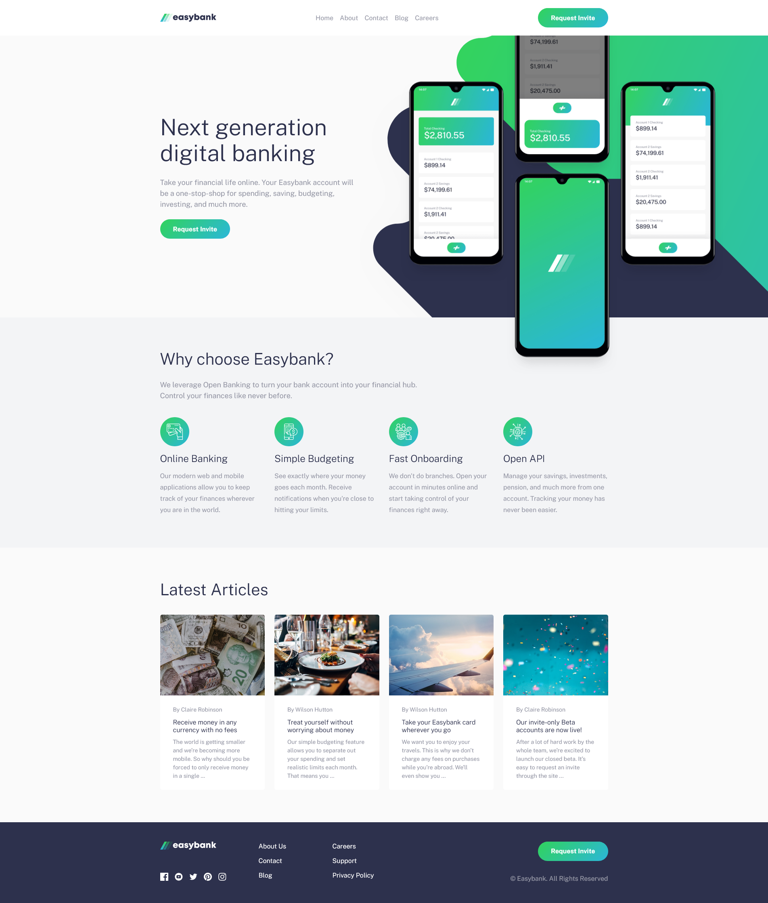

# Frontend Mentor - Easybank landing page solution

This is a solution to the [Easybank landing page challenge on Frontend Mentor](https://www.frontendmentor.io/challenges/easybank-landing-page-WaUhkoDN). Frontend Mentor challenges help you improve your coding skills by building realistic projects.

## The challenge

Users should be able to:

- View the optimal layout for the site depending on their device's screen size
- See hover states for all interactive elements on the page

## Screenshot

## Links

- Solution URL: [Frontend Mentor Solution Page](https://www.frontendmentor.io/solutions/easybank-landing-page-xlxEMOQ-o5)
- Live Site URL: [GitHub Pages Site](https://karolbanat.github.io/easybank-landing-page/)

## Useful resources

- [Kevin Powell's YouTube video](https://www.youtube.com/watch?v=eX9JhQtMxCg)
- [Kevin Powell's YouTube channel](https://www.youtube.com/kepowob)

## Author

- Frontend Mentor - [@karolbanat](https://www.frontendmentor.io/profile/karolbanat)
